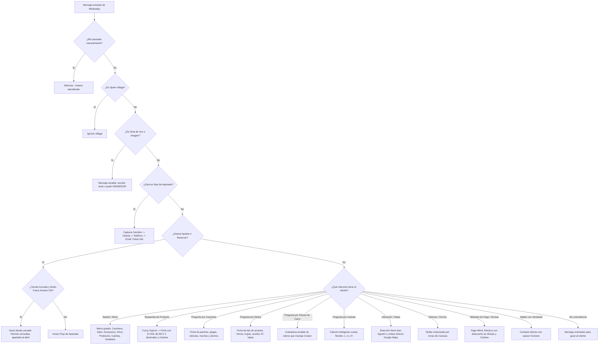

# 🛞🏍️ Crastur - Insumos para Caucheras, Repuestos de Moto & Otros Productos

Sistema integral de atención y ventas automatizadas por WhatsApp para **Crastur** (Insumos para Caucheras, Repuestos y Accesorios para Moto y Otros Productos en Caracas). Cuenta con financiamiento **Cashea**, conversión en vivo a Bolívares con tasa oficial del **Banco Central de Venezuela (BCV)** a 2 decimales, motor de apartados por 24 horas, seguimiento automático a clientes y panel administrativo visual con **Live Inbox**, diseñado para ejecutarse localmente con máxima privacidad y sin costos de APIs externas.

---

## 🌟 Características Principales

### 1. 🤖 Motor de WhatsApp Modular e Inteligente (`server/bot/`):
- **Identidad Comercial Definida en 4 Categorías:**
  1. 🛞 **Insumos para Caucheras:** Parches en frío/caliente, pega química azul, válvulas sin tripa TR-414, mechas/tarugos para pinchazos, plomos de balanceo adhesivos y herramientas.
  2. 🏍️ **Repuestos para Moto:** Kits de arrastre (cadena 428H, piñón y corona), pastillas y bandas de freno, bujías de encendido, aceites de motor 4T/2T, tripas y cauchos.
  3. 🎽 **Accesorios para Moto:** Puños para manubrio, mallas porta-casco (pulpos), retrovisores, luces LED y spray para cadena.
  4. 📦 **Otros Productos:** Aceites de motor, refrigerantes para radiador, limpiadores de inyectores, aditivos, bombillos y plumillas.
- **Redacción Callejera Venezolana y Cero Tecnicismos:**
  - Respuestas en lenguaje cotidiano y directo que cualquier cliente entiende al instante, sin tecnicismos confusos.
  - Cero menciones de autos/carros y cero uso de palabras complejas como "misceláneos".
- **Búsqueda Difusa (*Fuzzy Search*) y Cotizador de Combos:**
  - Tolera faltas de ortografía (ej: *"parxhes"*, *"pastiyas"*, *"bujia"*, *"tripa"*, *"kit de arastre"*).
  - Si el cliente consulta varios productos a la vez (ej: *"kit de arrastre bera y aceite 20w50"*), el bot desglosa los subtotales en USD y Bs, calcula el total combinado y permite apartar el combo completo.
- **Tasa Oficial BCV Estricta a 2 Decimales:**
  - Sincronización en vivo con el portal oficial del BCV, formateando siempre a dos decimales (`Bs. 852,42 / USD`) en todos los mensajes y presupuestos.
- **Flujo de Apartados / Reservas por 24 Horas:**
  - Permite al cliente reservar su pieza o combo en caja sin costo:
    1. Captura de Nombre y Apellido.
    2. Cédula de Identidad venezolana (`V-` o `E-`).
    3. Teléfono de contacto nacional (`0412`, `0414`, `0424`, `0416`, `0426`).
    4. Emisión de ticket digital con hora límite estricta de 24 horas continuas de retiro en tienda. Si no se retira, el sistema libera el stock automáticamente.
- **Financiamiento Cashea con Regla de $25 USD Mínimo:**
  - Desglosa inicial y 3 cuotas quincenales a 0% interés.
  - Si el producto cuesta menos de $25, explica de forma proactiva la política y sugiere armar un combo para acceder al financiamiento en la tienda física.
- **Tarifas de Delivery a Toda Caracas:**
  - Detecta sectores (Chacao, Catia, Baruta, El Valle, Petare, etc.) y cotiza las tarifas estimadas de motorizado configuradas en el panel.
- **Orientación Inteligente ante Consultas de Carros:**
  - Si un usuario pregunta por piezas pesadas de motor de carro (como cigüeñales o cajas de velocidad), el bot aclara amablemente la especialidad de Crastur (caucheras, motos y productos como refrigerantes o aceites) para evitar confusiones.

---

### 2. 🖥️ Panel Administrativo (React 19 + Tailwind CSS + Vite):
- **Diseño Ergonómico y Cero Errores Visuales:**
  - Sidebar espaciado con ícono auténtico de motocicleta y distintivo horizontal `MOTO & CAUCHERA`.
  - Header con badges simétricos a la misma altura (40px) y tasa BCV oficial en 2 decimales.
  - Cero bordes blancos involuntarios gracias a tokens oscuros calibrados.
- **Base de Datos Inicial en 0:**
  - El sistema arranca limpio de productos ficticios, con las 4 categorías comerciales preconfiguradas para registrar inventario real con 1 clic.
- **Prevención de Errores Humanos (`ConfirmModal`):**
  - Modales de confirmación antes de eliminar productos, liberar apartados, reiniciar sesiones de WhatsApp o alterar tarifas.
- **Calculadora Cashea Integrada:**
  - Selector con buscador en vivo para cotizar cuotas rápidamente y copiarlas formateadas para WhatsApp.
- **Conexión WhatsApp:**
  - Generador de código QR en pantalla y botón para purgar credenciales viejas y solicitar un QR limpio al instante.

---

### 3. 🛡️ Resiliencia, Privacidad y Rendimiento:
- **Base de Datos SQLite en RAM (`sql.js` WASM):** Consultas en sub-milisegundos, sin bloqueos de disco y con persistencia atómica en `data/crastur.db`.
- **Copias de Seguridad Diarias Automáticas:** Respaldos fechados cada 24 horas en `data/backups/` con rotación automática de 7 días.
- **Blindaje Anti-Caídas:** Monitores de proceso `uncaughtException` y `unhandledRejection` para garantizar que el servidor jamás se detenga ante fallos de red.
- **Protección Anti-Spam:** Detección de ráfagas para proteger la línea contra bloqueos de WhatsApp.

---

## 🧭 Flujo de Decisión del Bot



---

## 📁 Estructura del Proyecto

```text
crastur/
├── Crastur.bat                 # EJECUTABLE MAESTRO (Windows 1-clic, 0 alertas Defender)
├── Crear-Acceso-Directo.bat    # Crea el acceso directo en el Escritorio con crastur.ico
├── crastur.ico                 # Icono oficial de Windows (7 resoluciones de 16x16 a 256x256)
├── iniciar_crastur.sh          # Lanzador ejecutable para Linux / Ubuntu
├── launcher.js                 # Verificador inteligente multiplataforma
│
├── client/                     # Panel Web Administrativo (React 19, Tailwind CSS, Vite)
│   ├── public/
│   │   ├── favicon.svg         # Favicon oficial con isotipo de moto en relieve
│   │   └── favicon.ico         # Favicon estándar para navegadores
│   ├── src/
│   │   ├── components/
│   │   │   ├── layout/         # Sidebar (espaciado estético) y Header (simetría)
│   │   │   ├── views/          # CatalogView, ReservationsView, DashboardView, SettingsView, etc.
│   │   │   └── modals/         # ProductModal, ConfirmModal, SellerModal, ReservationModal
│   │   └── constants/          # categories.js (4 categorías oficiales y subcategorías)
│   └── dist/                   # Build compilado de producción
│
├── server/                     # Backend local en Node.js
│   ├── bot/                    # MOTOR MODULAR DEL BOT DE WHATSAPP
│   │   ├── index.js            # Enrutador principal de mensajes
│   │   ├── config/             # synonyms.js (callejero venezolano), stopWords.js
│   │   ├── utils/              # formatters.js (BCV 2 decimales), caracasDelivery.js, antiSpam.js
│   │   ├── services/           # searchService.js, businessRules.js
│   │   ├── handlers/           # greeting, info, product, cashea, advisory, fallback
│   │   └── apartado/           # apartadoFlow.js (Embudo 24h)
│   ├── database.js             # SQLite WASM, migraciones, PRAGMA checks y respaldos 7 días
│   ├── whatsappService.js      # Baileys WhatsApp con debounce por cliente y reconexión
│   ├── bcvService.js           # Scraping oficial del BCV en vivo
│   └── server.js               # Servidor Express y WebSocket
│
└── data/                       # Almacenamiento local persistente
    ├── crastur.db              # Base de datos SQLite
    ├── backups/                # Respaldos diarios rotativos
    └── auth_info_baileys/      # Sesión vinculada de WhatsApp
```

---

## 🚀 Cómo Iniciar el Sistema

### En Windows (Recomendado):
* **Opción 1:** Haz doble clic en **`Crastur.bat`**. Abrirá el servidor y la ventana de escritorio automáticamente.
* **Opción 2 (Con Ícono en el Escritorio):** Haz doble clic en **`Crear-Acceso-Directo.bat`**. Creará de inmediato el icono en tu Escritorio con la imagen oficial `crastur.ico` asignada.

### En Linux:
```bash
./iniciar_crastur.sh
```

### Vincular WhatsApp por primera vez:
1. Abre el panel web en tu computadora.
2. Ve a la pestaña **Conexión WhatsApp**.
3. En tu teléfono, abre WhatsApp ➔ *Dispositivos vinculados* ➔ *Vincular un dispositivo*.
4. Escanea el código QR que aparece en pantalla.
5. ¡Listo! El bot atenderá a todos los clientes de forma automática las 24 horas del día.
